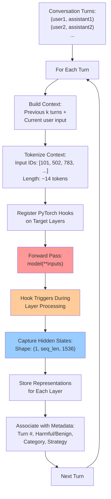

# Representation Collection Flow Diagram

## Mermaid Diagram Code

## Process Description

This diagram shows the exact flow of how we collect representations during our multi-turn jailbreak analysis:

1. **Input**: Conversation turns from our crescendo attack dataset
2. **Context Building**: For each turn, we build the conversation context using previous k turns plus the current user input
3. **Tokenization**: Convert the context to input tokens (~14 tokens typically)
4. **Hook Registration**: Set up PyTorch forward hooks on target model layers
5. **Forward Pass**: Run the tokenized context through the model (no generation, just encoding)
6. **Representation Capture**: Hooks trigger and capture hidden states with shape (1, seq_len, 1536)
7. **Storage**: Store representations with metadata (turn number, harmful/benign label, etc.)
8. **Iteration**: Repeat for next turn

## Key Technical Details

- **Input-Only Processing**: We only process the conversation context, not generate responses
- **Real-Time Capture**: Representations are captured during the actual forward pass
- **Layer-Specific**: We target specific layers (0, 7, 14) representing early, middle, and late processing
- **Metadata Association**: Each representation is linked to conversation metadata for analysis

## Current Status

- ✅ **Pipeline Implemented**: The representation extraction system is built and tested
- ⚠️ **Memory Issues**: Real extraction faces memory constraints due to model reloading
- ✅ **Analysis Framework**: Classifier training and evolution analysis working
- ❌ **Real Data**: Current results based on synthetic data, not actual model representations

The next step is optimizing the extraction pipeline to work with real model data.
